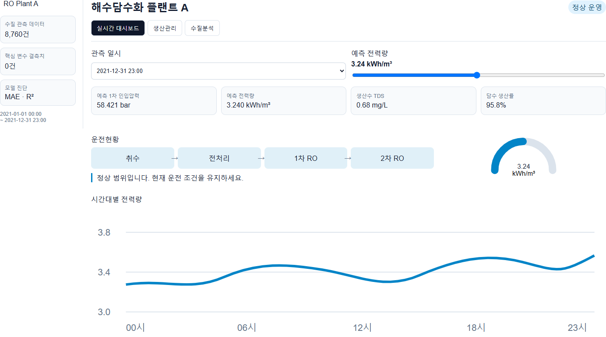
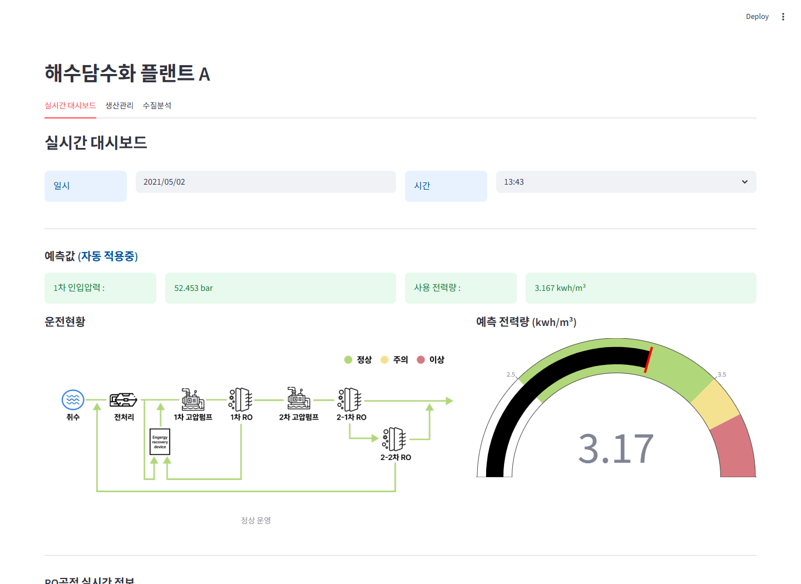
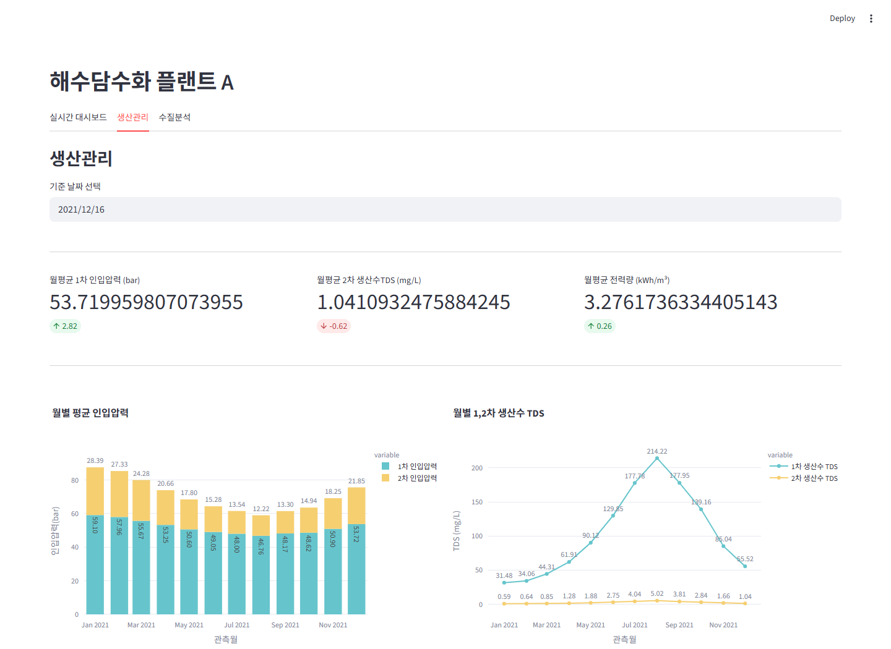
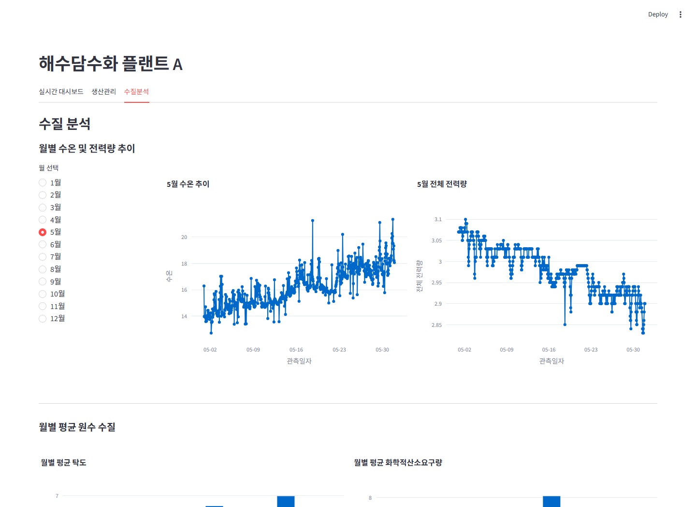

# RO 해수담수화 공정 예측 대시보드

RO 해수담수화 공정 데이터를 분석해 인입압력과 전력 사용량을 예측하고, 공정 상태를 운영자가 한눈에 확인할 수 있도록 구성한 Streamlit 기반 데이터 대시보드입니다.

수질 데이터와 RO 공정 데이터를 연결해 수온, pH, 탁도, COD, 총질소, 총인 등 주요 지표가 공정 에너지 사용량에 미치는 영향을 시각화했습니다. 예측 결과는 실시간 대시보드, 생산관리, 수질분석 화면으로 나누어 운영 관점에서 확인할 수 있습니다.

## Preview

### 고도화된 실시간 대시보드



데이터·모델 상태 사이드바, 핵심 운영 지표 카드, RO 공정 흐름,
에너지 사용량 게이지와 시간대별 추이를 한 화면에서 확인할 수 있습니다.

<details>
<summary>기존 화면별 미리보기</summary>

### 실시간 대시보드



### 생산관리



### 수질분석



</details>

## 프로젝트 배경

해수담수화 공정은 수질과 운전 조건에 따라 필요한 압력과 전력량이 달라집니다. 고정된 기준으로 공정을 운영하면 에너지 낭비와 비용 증가가 발생할 수 있기 때문에, 수질 기반 전력량 예측과 공정 상태 시각화를 통해 효율적인 운영 의사결정을 돕는 도구를 만들었습니다.

## 주요 기능

| 기능 | 설명 |
| --- | --- |
| 실시간 대시보드 | 선택한 일시의 수질 데이터를 기반으로 1차 인입압력과 전력량을 예측합니다. |
| 공정 상태 시각화 | 예측 전력량에 따라 정상, 주의, 이상 상태를 공정 구성도와 게이지 차트로 표시합니다. |
| RO 공정 모니터링 | 인입압력, 생산수 TDS, 사용 전력량 등 주요 공정 지표를 이전 시점 대비 변화량과 함께 보여줍니다. |
| 생산관리 | 월별 압력, TDS, 전력량 변화를 비교해 생산 효율과 품질 흐름을 확인합니다. |
| 수질 분석 | 월별 수온, 전력량, 탁도, COD 등 수질 지표의 추이를 시각화합니다. |

## 기술 스택

| 영역 | 기술 |
| --- | --- |
| Language | Python |
| Dashboard | Streamlit |
| Data | Pandas, NumPy |
| Machine Learning | Scikit-learn, Joblib |
| Visualization | Plotly, Matplotlib, Seaborn, Folium |

## 예측 모델

| 모델 파일 | 역할 |
| --- | --- |
| `LR_pressure.pkl` | 수온, pH 기반 1차 인입압력 예측 |
| `RF_elec.pkl` | 수질 및 공정 변수를 활용한 전체 전력량 예측 |
| `random_model.pkl` | 실험용 랜덤 포레스트 모델 |

## 프로젝트 구조

```text
.
├── app3.py
├── app.py
├── desalination/
│   ├── analytics.py
│   ├── domain.py
│   └── resources.py
├── tests/
│   └── test_domain.py
├── requirements.txt
├── LR_pressure.pkl
├── RF_elec.pkl
├── random_model.pkl
├── RO공정데이터.csv
├── RO공정데이터_0621.csv
├── 해양환경공단_해양수질자동측정망_천수만(2021).csv
├── docs/
│   └── images/
│       ├── enhanced-dashboard.png
│       ├── dashboard.png
│       ├── production.png
│       └── water-quality.png
└── *.csv / *.png
```

## 실행 방법

```bash
git clone https://github.com/boclair98/haesudamsuhwa_project_streamlit.git
cd haesudamsuhwa_project_streamlit
pip install -r requirements.txt
streamlit run app3.py
```

브라우저에서 `http://localhost:8501`로 접속하면 대시보드를 확인할 수 있습니다.

## 테스트

운영 단계 경계값, 수질 달성률, 생산 진척률의 핵심 로직은 표준 라이브러리
`unittest`로 검증합니다.

```bash
python -m unittest discover -s tests -v
```

## 안정성 및 운영 개선

- 데이터와 모델 경로를 프로젝트 루트 기준으로 해석해 실행 위치에 따른 오류를 제거했습니다.
- CSV 열과 날짜, 모델 입력 열 수를 검증하고 사용자에게 이해 가능한 오류를 표시합니다.
- 데이터의 실제 관측 범위를 날짜 선택 범위로 사용합니다.
- 수질 달성률을 `실제 제거량 / 기준 충족에 필요한 제거량`으로 계산하고 0~100%로 제한합니다.
- 전력 사용량의 정상·주의·경고 판정을 하나의 도메인 규칙으로 통합했습니다.
- 사이드바에서 데이터 결측치와 과거 데이터 기준 모델 MAE·R²를 확인할 수 있습니다.
- 캐시된 원본 데이터프레임을 직접 변경하지 않아 탭 전환과 재실행 결과가 일관됩니다.

## 대시보드 흐름

```text
수질/공정 데이터 로딩
  -> 일시 기반 데이터 필터링
  -> 1차 인입압력 예측
  -> 전력량 예측
  -> 공정 상태 판단
  -> 대시보드 시각화
```

## 성과

- 수질 데이터와 RO 공정 데이터를 결합해 운영 지표를 한 화면에서 확인할 수 있도록 구성했습니다.
- 선형회귀와 랜덤포레스트 모델을 활용해 압력 및 전력량 예측 흐름을 구현했습니다.
- 예측값을 단순 수치로 끝내지 않고, 공정 구성도와 게이지 차트로 연결해 운영자가 직관적으로 해석할 수 있게 만들었습니다.
- Streamlit을 활용해 데이터 분석 결과를 웹 기반 대시보드 형태로 빠르게 구현했습니다.

## 추가 개선 예정

- 모델 학습 파이프라인과 추론 코드 완전 분리
- 시간 순서 기반 학습·검증 분할 및 교차 검증
- 모델 버전, 학습 데이터 버전, 실험 파라미터 기록
- 실시간 센서 또는 공정 API 연결
